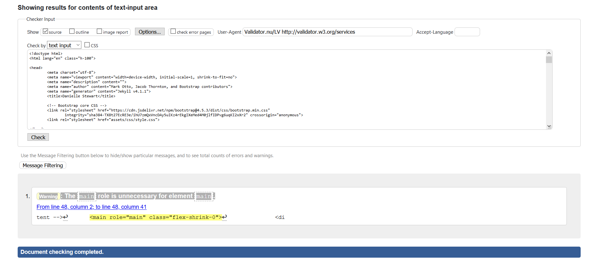

python3 -m http.server

# My Milestone project one

### This website is to showcase skills and make my details available so potential job opportunities and clients that want me to work for them.

## UX

### This website is created for myself to show my work history and show what I have accomplished in the software development world I wanted the design to be bright and noticeable. I started off wanting 3 separate pages but after a talk with my mentor I realised a 1 page website with separate sections would be best. My website is simple easily laid out so any potential clients or employers can see what I have worked on my skills and fill in the query form to contact me.

As a potential employer I want to clearly see what the person is capable of and what their history and what they have achieved so I can decide if I want to get in contact with them.
As the owner of the website I want to be able to showcase my skills to attract would be clients and employers.

 

## Existing Features

- Navbar - allows users to achieve navigating the website , by having them click on the name of the section they want to visit
- Slideshow – allows potential employers to achieve the goal of seeing what I have worked on in the past by scrolling through it
- Form- allows potential employers to contact me by having them fill in the form and pressing submit

## Features Left to Implement

- Links to social media
- Add a Calendly link so can set up meetings with me
- A section with projects I am currently working on

# Technologies Used

### Bootstrap 4

I used this template as it was simple and I could customise it quite a bit 
https://getbootstrap.com/docs/4.0/examples/sticky-footer-navbar/

### Git Hub

I used this form example as it had all the boxes I wanted to use and looked good 
https://github.com/cjcon90/safetree

### W3 schools

I used this website and got the template for the slideshow as I wanted a better way to show off my work history
https://www.w3schools.com/

Html

CSS 

# Testing

I used https://jigsaw.w3.org/css-validator/ to validate my CSS and I took a screenshot of the results

I used https://validator.w3.org/nu/#textarea to test my html and it kept coming back one error saying 

** Warning: The main role is unnecessary for element main. ** 

 main role="main" class="flex-shrink-0" 

 But when I took out that line of code my home section text layered over each other so I have left it in.

 
 

 I had to remove som quotation marks i had left out and ending div and section tags that I had forgotten to put in 

